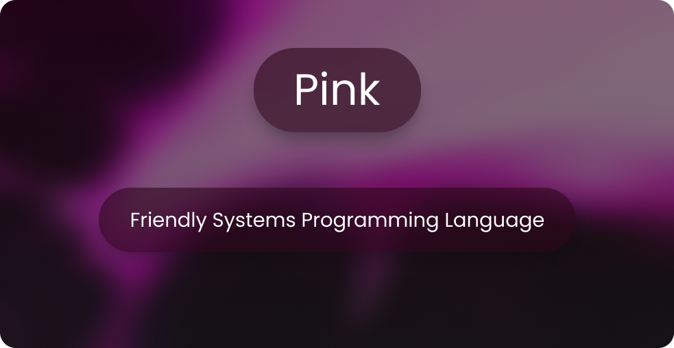

<p align="left">
  
</p>

```kt
import io

fun main(): int {
    println("Hello, Pink");
    return 0;
}
```

## About

Pink is a programming language that is designed to be easy to use, and fun to write.
It is a statically typed, compiled language, with a focus on simplicity.

## Building

See [`BUILDING.md`](./BUILDING.md)

## License

Pink is MPL 2.0 licensed.

See [`LICENSE`](./LICENSE)
